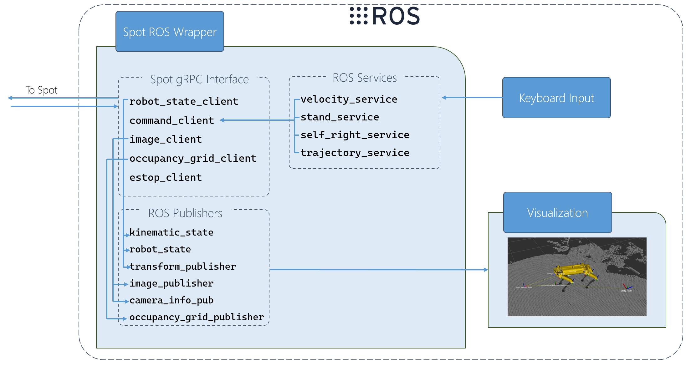

		
# Introduction 
Enable programmatic control of the Boston Dynamic Spot robot through the [Robot Operating System](https://www.ros.org/) (ROS) interface. 

# Overview

The [spot_ros_interface](./spot_ros_interface/) ROS package provides a ROS interface to the Spot API converting ROS messages to API/gRPC calls to the Spot robot.

## Architecture Overview



# Getting Started
## 1.	Installation process

#### 1.1 Set up WSL (Ubuntu 20.04):
https://docs.microsoft.com/en-us/windows/wsl/install-win10

#### 1.2 Download and install Spot SDK (in WSL environment):
https://github.com/boston-dynamics/spot-sdk/blob/master/docs/python/quickstart.md#getting-the-code

#### 1.3 Set up app token to allow communication with Spot:

Copy token from `~/ms_robotics_spot/src/docs/tokens/dev.app_token` to the default location ~/.bosdyn/dev.app_token:
```
cp ~/ms_robotics_spot/src/docs/tokens/dev.app_token ~/.bosdyn
```

#### 1.4 Set up ROS Noetic in WSL:
- Configure your Ubuntu repositories to allow "restricted," "universe," and "multiverse". Follow instructions [here](https://help.ubuntu.com/community/Repositories/CommandLine).
Remember to `sudo apt-get update` after this.


- Set up sources.list
```
sudo sh -c 'echo "deb http://packages.ros.org/ros/ubuntu $(lsb_release -sc) main" > /etc/apt/sources.list.d/ros-latest.list'
```
- Set up keys
```
sudo apt-key adv --keyserver 'hkp://keyserver.ubuntu.com:80' --recv-key C1CF6E31E6BADE8868B172B4F42ED6FBAB17C654
```
If you experience issues connecting to the keyserver, you can try substituting `hkp://pgp.mit.edu:80`

Alternatively, you can use curl instead of the apt-key command, which can be helpful if you are behind a proxy server:

```
curl -sSL 'http://keyserver.ubuntu.com/pks/lookup?op=get&search=0xC1CF6E31E6BADE8868B172B4F42ED6FBAB17C654' | sudo apt-key add -
```

If you still experience issues like:
 `gpg: keyserver receive failed: No dirmngr`
 or
 `gpg: can't connect to the agent: IPC connect call failed`  (see [here](https://github.com/microsoft/WSL/issues/5125) and [here](https://stackoverflow.com/questions/46673717/gpg-cant-connect-to-the-agent-ipc-connect-call-failed)), ensure `dirmngr` is installed:
 ```
 sudo apt-get install dirmngr
 ```
 If this still does not solve the problem:
```
sudo apt remove gpg
sudo apt install gnupg1
```
You should now be able to re-run the key setup command above.
- Install
```
sudo apt update
sudo apt install ros-noetic-desktop-full
```
This will take some time. Go grab a coffee :coffee:.

Once that is done, let us verify the installation. You must source this script in every bash terminal you use ROS in:
```
source /opt/ros/melodic/setup.bash
```
To automatically source it whenever you open a new terminal, add it to your .bashrc:
```
echo "source /opt/ros/melodic/setup.bash" >> ~/.bashrc
source ~/.bashrc
```
*Note:* If you were in a virtual environment, you will have to re-activate your virtual environment after sourcing your .bashrc


To verify the installation, run `roscore` in the terminal. This should start a roslaunch server without any errors. Feel free to kill the server (Ctrl+C) now.

Congratulations! You have just set up ROS. Now let's install the  the dependencies.

## 2.	Software dependencies

Make `install_dependencies.sh` executable and run it:
```
cd ~/ms_robotics_spot/src/install_script/
chmod +x install_dependencies.sh
./install_dependencies.sh
```
## 3.   Set up catkin workspace
Now, go to your catkin workspace directory (e.g. `~/ms_robotics_spot`) and setup your catkin workspace:
```
cd ~/ms_robotics_spot
catkin config --init --merge-devel --cmake-args -DCMAKE_BUILD_TYPE=Release
catkin config --extend /opt/ros/noetic
```

*Note:* The structure of a catkin workspace must be as follows. For more info on catkin workspaces and packages, consult the [tutorials](http://wiki.ros.org/catkin/workspaces).
```
workspace_directory/
    src/
        package_1/
            CMakeLists.txt
            package.xml
            scripts/
            src/
        ...
        package_n/
            CMakeLists.txt
            package.xml
            scripts/
            src/
    build/                      -- Auto-generated by catkin build
    devel/                      -- Auto-generated by catkin build
```

# Build and Run
Go to your catkin workspace directory, and build
```
cd ~/ms_robotics_spot
catkin build
```

After the build finishes, you must source the environment. **This must be done every time after building.**
```
source ~/ms_robotics_spot/devel/setup.bash
```

Now let us start the ROS Wrapper Node. We first need to run `roscore`:
```
roscore
```
That process must be up and running whenever you want to run ROS Nodes.

Open a new terminal, source your virtual environment and source the latest build:
```
# In a new terminal
activate_venv spot_venv
cd ~/ms_robotics_spot
source devel/setup.bash
```
And finally, let us start the ROS Wrapper node:
```
rosrun spot_ros_interface  spot_ros_interface.py --username USERNAME --password PASSWORD  192.168.80.3
```
*Note:* Spot's default IP address is 192.168.80.3 over WiFi, and 10.0.0.3 over ethernet.

*Note:* You must be able to ping Spot's IP addess in order to communicate. The easiest way to do so is to connect to Spot's Wi-Fi hotspot directly, or to its ethernet port. For more information, reference Spot's instruction manuals on ways to communicate.

### Controlling Spot from your keyboard

With the ROS wrapper running, open a new terminal and run `keyboard_teleop.py` in the `spot_ros_interface` ROS package:
```
rosrun spot_ros_interface keyboard_teleop.py
```
and follow the instructions on screen.

Ensure `spot_ros_interface.py` is running.

*Note:* If Spot is in a faulty state and/or upside down, make sure to call the self-right command first (from the keyboard_teleop application, press "r").

### To run occupancy grid visualizer

```
roslaunch spot_urdf rviz_display.launch
```

Potential Issues:

- Spot model RViz visualization is white and not oriented properly
    - Solution: Ensure spot_ros_interface and robot_state_publisher nodes are running (the latter should have started by the rvis_display.launch file).

- The occupancy grid is not being displayed:
    - Solution: Ensure that RViz is set to display a Marker type msg (on the left-hand panel), and that it is subscribed to the `occupancy_grid` topic.

# ROS Package guidelines
[ROS package guidelines](https://github.com/ethz-asl/mav_tools_public/wiki/How-to-Write-a-ROS-Package)

Contribute

This project has adopted the [Microsoft Open Source Code of Conduct](https://opensource.microsoft.com/codeofconduct/). For more information see the [Code of Conduct FAQ](https://opensource.microsoft.com/codeofconduct/faq/) or contact [opencode@microsoft.com](mailto:opencode@microsoft.com) with any additional questions or comments.


